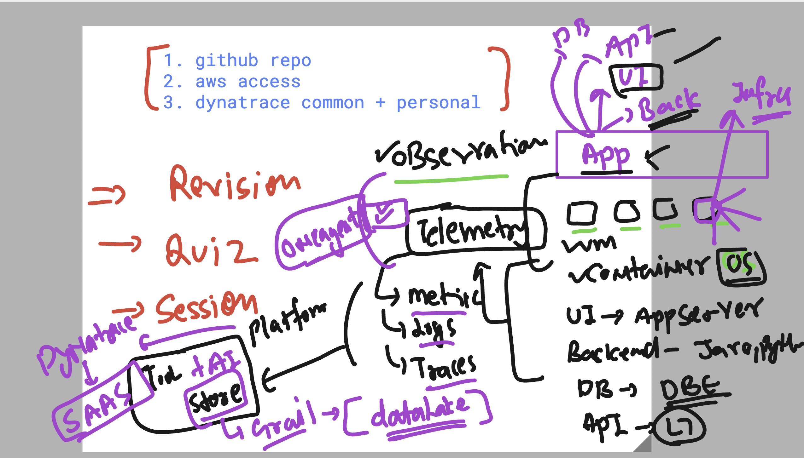

# vodafone_dynatrace_6thOct2025

### Revision overview 




### Installing Oneagent in Linux host 

```
[ec2-user@ip-172-31-10-152 ~]$ sudo -i

[root@ip-172-31-10-152 ~]# wget  -O Dynatrace-OneAgent-Linux-1.321.51.20250905-075429.sh "https://zjc99027.live.dynatrace.com/api/v1/deployment/installer/agent/unix/default/latest?arch=x86" 
HTTP request sent, awaiting response... 200 OK
Length: 225207383 (215M) [application/octet-stream]
Saving to: ‘Dynatrace-OneAgent-Linux-1.321.51.20250905-075429.sh’

Dynatrace-OneAgent-Linux-1.321.51.20250 100%[=============================================================================>] 214.77M  15.9MB/s    in 15s     

2025-10-07 04:55:21 (14.2 MB/s) - ‘Dynatrace-OneAgent-Linux-1.321.51.20250905-075429.sh’ saved [225207383/225207383]


[root@ip-172-31-10-152 ~]# wget https://ca.dynatrace.com/dt-root.cert.pem ; ( echo 'Content-Type: multipart/signed; protocol="application/x-pkcs7-signature"; micalg="sha-256"; boundary="--SIGNED-INSTALLER"'; echo ; echo ; echo '----SIGNED-INSTALLER' ; cat Dynatrace-OneAgent-Linux-1.321.51.20250905-075429.sh ) | openssl cms -verify -CAfile dt-root.cert.pem > /dev/null
--2025-10-07 04:55:24--  https://ca.dynatrace.com/dt-root.cert.pem
Resolving ca.dynatrace.com (ca.dynatrace.com)... 13.226.2.118, 13.226.2.2, 13.226.2.85, ...
Connecting to ca.dynatrace.com (ca.dynatrace.com)|13.226.2.118|:443... connected.
HTTP request sent, awaiting response... 200 OK
Length: 4340 (4.2K) [binary/octet-stream]
Saving to: ‘dt-root.cert.pem’

dt-root.cert.pem                        100%[=============================================================================>]   4.24K  --.-KB/s    in 0s      

2025-10-07 04:55:25 (70.4 MB/s) - ‘dt-root.cert.pem’ saved [4340/4340]


CMS Verification successful


[root@ip-172-31-10-152 ~]# 
[root@ip-172-31-10-152 ~]# 
[root@ip-172-31-10-152 ~]# /bin/sh Dynatrace-OneAgent-Linux-1.321.51.20250905-075429.sh --set-monitoring-mode=fullstack --set-app-log-content-access=true


04:55:40 Checking root privileges...
04:55:40 Process real user: root, real ID: 0
04:55:40 Process effective user: root, effective ID: 0
04:55:40 Process root access: true
04:55:40 Logging to /var/log/dynatrace/oneagent/installer/installation_2815.log
04:55:40 Installation started, version 1.321.51.20250905-075429, build date: 05.09.2025, PID 2815.
04:55:40 Detected platform: LINUX arch: X86_64
04:55:40 Checking /opt/dynatrace/oneagent for prohibited mount flags
04:55:40 Checking free space in /opt/dynatrace/oneagent
04:55:40 Extracting...
04:55:41 Unpacking. This may take a while...

```

### after setup 

```
 systemctl status oneagent
● oneagent.service - Dynatrace OneAgent
     Loaded: loaded (/etc/systemd/system/oneagent.service; enabled; preset: disabled)
     Active: active (running) since Tue 2025-10-07 04:56:45 UTC; 11s ago
    Process: 14614 ExecStart=/opt/dynatrace/oneagent/agent/initscripts/oneagent start (code=exited, status=0/SUCCESS)
   Main PID: 14695 (oneagentwatchdo)
      Tasks: 38 (limit: 1053)
     Memory: 102.3M
```


