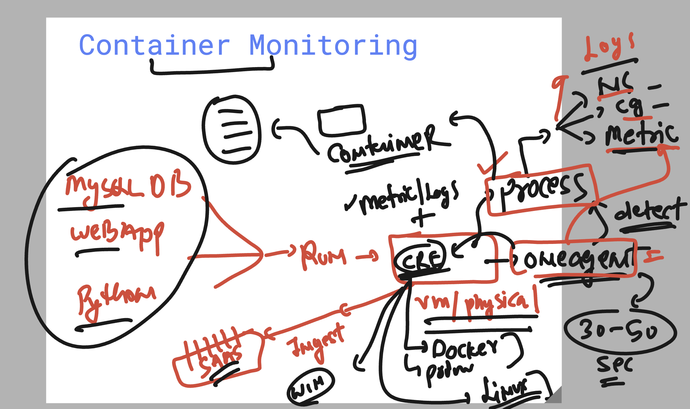

### Container based process monitoring 



### more detailed understanding of container monitoring


### creating a sample webapp container 

```
ec2-user@ip-172-31-34-94 ~]$ sudo -i
[root@ip-172-31-34-94 ~]# docker ps
CONTAINER ID   IMAGE     COMMAND   CREATED   STATUS    PORTS     NAMES
[root@ip-172-31-34-94 ~]# 

[root@ip-172-31-34-94 ~]# docker run -itd --name ashuapp1 --restart always -p 1234:80 dockerashu/ashubmoweb:bmov50642bcb9c117c19d94593e853ec2155dab3fff8
Unable to find image 'dockerashu/ashubmoweb:bmov50642bcb9c117c19d94593e853ec2155dab3fff8' locally
bmov50642bcb9c117c19d94593e853ec2155dab3fff8: Pulling from dockerashu/ashubmoweb
09f376ebb190: Pull complete 
5529e0792248: Pull complete 
9b3addd3eb3d: Pull complete 
57910a8c4316: Pull complete 
7b5f78f21449: Pull complete 
b7923aa4e8a6: Pull complete 
785625911f12: Pull complete 
dc56449eded4: Pull complete 
Digest: sha256:d8066d5c4aa1b80564566c321712de0a86de97e30161a6daeee7b46798bd5215
Status: Downloaded newer image for dockerashu/ashubmoweb:bmov50642bcb9c117c19d94593e853ec2155dab3fff8
fa2044d1d92a875f6c53d9b3510d444adad6991fd2fd254cf1d61b73d01618f4
[root@ip-172-31-34-94 ~]# docker ps
CONTAINER ID   IMAGE                                                                COMMAND                  CREATED         STATUS         PORTS                                   NAMES
fa2044d1d92a   dockerashu/ashubmoweb:bmov50642bcb9c117c19d94593e853ec2155dab3fff8   "/docker-entrypoint.…"   9 seconds ago   Up 6 seconds   0.0.0.0:1234->80/tcp, :::1234->80/tcp   ashuapp1
[root@ip-172-31-34-94 ~]# 

```
