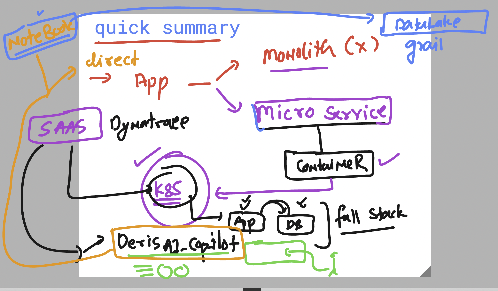

# vodafone_dynatrace_6thOct2025

### QUick summary 



### k8s and dynatrace understanding 


### Basic Integration of dynatrace to your aws cloud 


## Integration of dynatrace with k8s 

### after following UI steps from dynatrace UI -- now verify the same in k8s

```
kubectl get nodes
NAME                                STATUS   ROLES    AGE    VERSION
aks-agentpool-34915796-vmss000000   Ready    <none>   3h6m   v1.32.7
aks-agentpool-34915796-vmss000001   Ready    <none>   3h6m   v1.32.7
ashutoshh [ ~ ]$ kubectl get ns
NAME              STATUS   AGE
default           Active   3h7m
dynatrace         Active   170m
kube-node-lease   Active   3h7m
kube-public       Active   3h7m
kube-system       Active   3h7m
ashutoshh [ ~ ]$ 


 kubectl get  po -n dynatrace 
NAME                                  READY   STATUS    RESTARTS   AGE
dynatrace-oneagent-csi-driver-cxdwm   4/4     Running   0          171m
dynatrace-oneagent-csi-driver-ntnwq   4/4     Running   0          171m
dynatrace-operator-56886df45-4qpv6    1/1     Running   0          171m
dynatrace-webhook-84bc6c99b-4vsjg     1/1     Running   0          171m
dynatrace-webhook-84bc6c99b-lgmkr     1/1     Running   0          171m
k8smoncluster-activegate-0            1/1     Running   0          168m
k8smoncluster-oneagent-9hf49          1/1     Running   0          168m
k8smoncluster-oneagent-9qfhz          1/1     Running   0          168m

```
